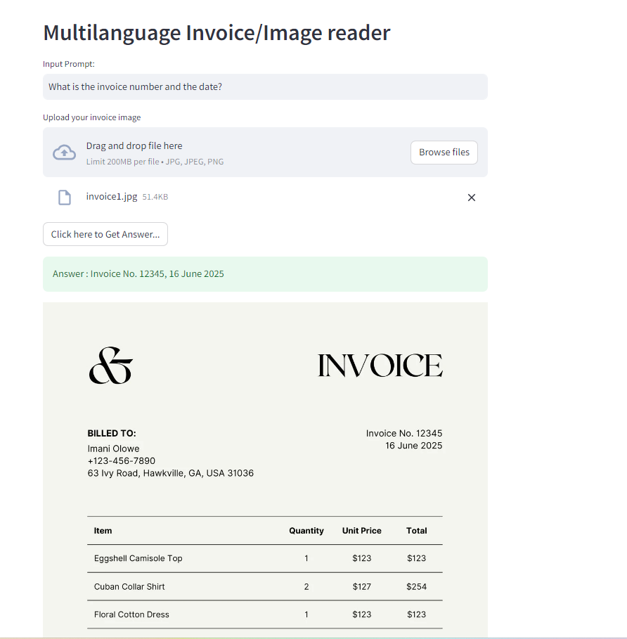
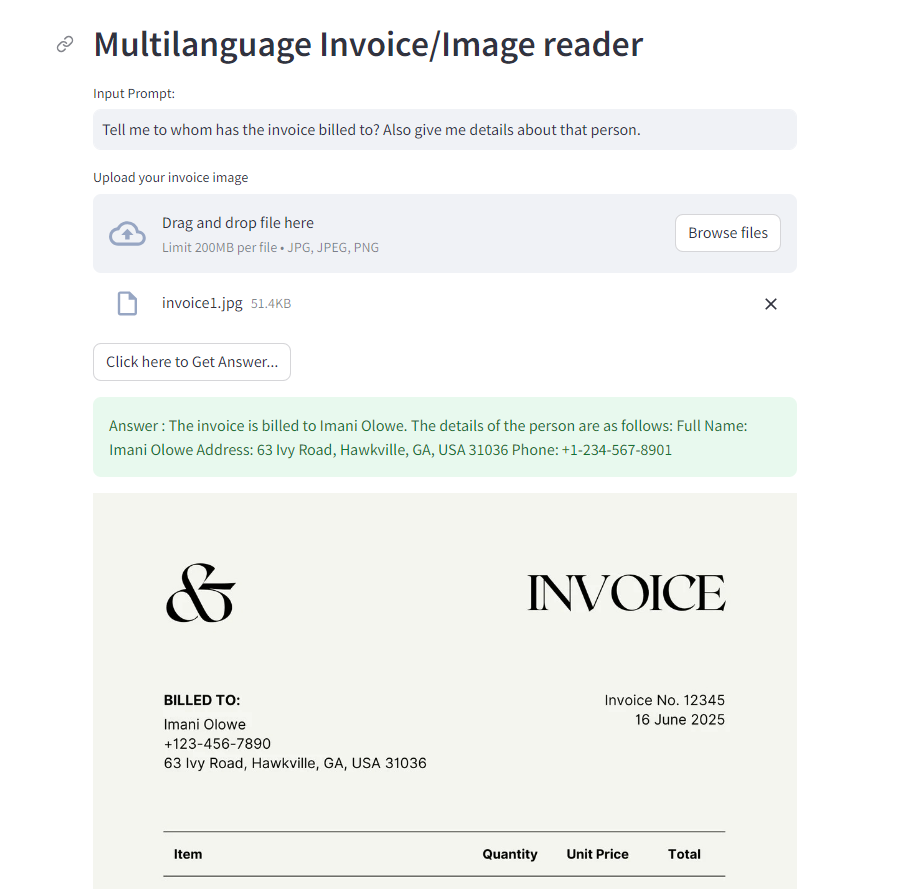
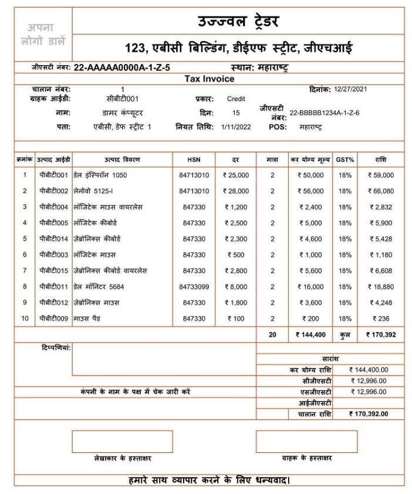
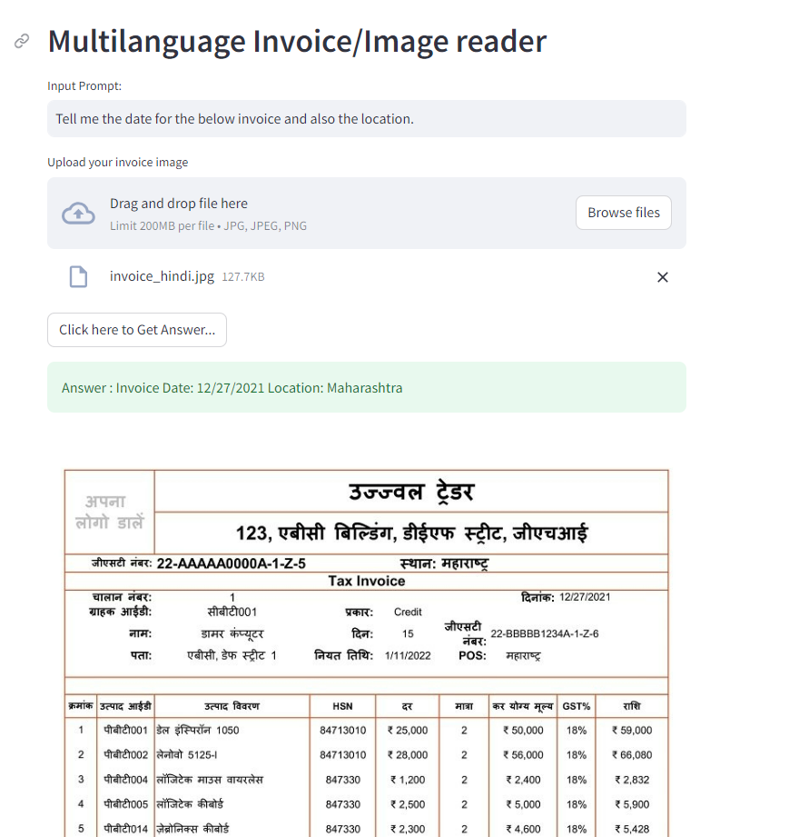
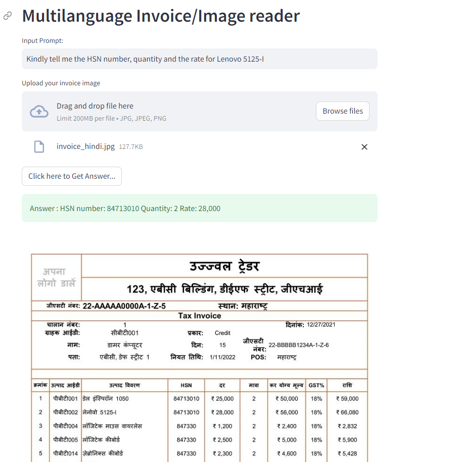

# Multilanguage-Invoice-reader

In this project, we are leveraging Gemini pro vision model to read the invoice which can be in multiple languages and then answer the question the user asks.

## Deployed Link

[Link](https://huggingface.co/spaces/SBairagi/Multilanguage-Invoice-reader)

Below are some snapshots, of the working of the model

